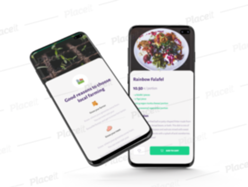

# Client project OlaFresco 🥗🥩🍜🚀

This exercise is about client communication and planning. Learning to use new design tools, plan my work to save development time (though there won't be any coding on this project), and communicate user stories through UML diagrams.

## Learning Objectives

- [x] Define the client’s needs
  * [Project brief](https://www.canva.com/design/DAEnW5Zv9-E/Uhn8j7tLrGG_zhIDm485hg/watch?utm_content=DAEnW5Zv9-E&utm_campaign=designshare&utm_medium=link&utm_source=publishsharelink)
- [x] Scope the project
- [x] Define User functionalities (login, logout, delete, ...
- [x] Prepare a UML diagram (for both navigations and actions)
  * [OlaFresco UML Diagram](https://bit.ly/2VVk1OV)
- [x] Prepare a wireframe of the website with for example balsamiq
  * [OlaFresco Wireframe](https://balsamiq.cloud/sbzozvn/p4p25ei)
- [x] Mind Map (it is published online just for 6 months)
  * [OlaFresco Mind Map](https://atlas.mindmup.com/2021/08/e5524a00000311ecb29ac1d36e5f0de8/olafresco_landing_page/index.html)
- [x] Prepare a mockup of the website using a design tool such as Figma
  * this is mockup is prepared in the form of mobile app because of client's wishes to focus on mobile first 
  * [OlaFresco mockup website](https://www.figma.com/file/zBXleZ1PFx5ZxIIIYX0ykp/Delivery-App_UI-Kit-Copy?node-id=33%3A444)
   
- [x] Communicate the endresult with the client
- [x] Add a quality readme

## Client needs (user stories)

### OlaFresco

OlaFresco needs a website for meal orders.

**Minimum client demands:**
* The landing page explains the service
* A member section to choose meals
* A member section to keep track of their orders
* An admin section to manage meal deliveries
* Member profile allows specifying user allergies that automatically filter meals

This website will look a lot like [hellofresh](https://www.hellofresh.be/?locale=nl-BE)

## Delivering exercise

A main readme which documents the learning objective requirements hosted on a GitHub repository.

## Observations and thoughts about project

This is my first time on hand writing and thinking in a sense of mind mapping and wire framing a project. Mand mapping was especially difficult 
because, yes, I had to really calm my mind and just stick to the logical path of the project. It is very useful to see a project in that kind of way before you jump
to coding, I really had clearer vision how would it suppose to look and going to use this more. After mind mapping wireframing comes easy because I can see
what actual components should be, how the lineup looks like, do I like it this way. I lost a quite of time on it but just because I changed it few times, 
complicating things...but yeah, that's me...(maybe this personality trait shouldn't be public 🤫) Anyway, quality time thinking besides the code and have some sneak peek
how project planning should actually go and how it is important part of developing. 

# Thank you for long read!

